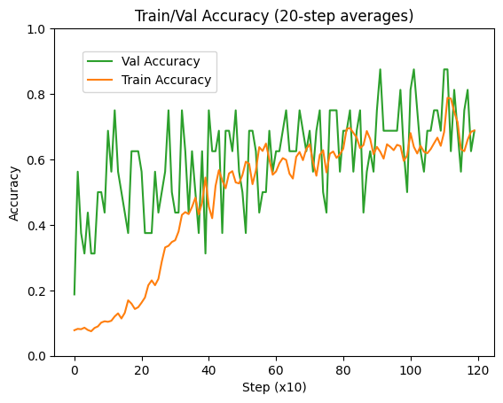
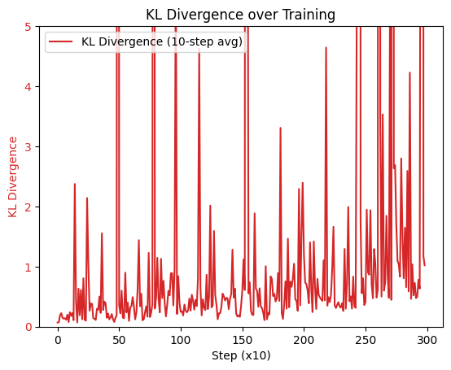

# GRPO (Group Relative Policy Optimization) — Countdown Task

**[Writeup: Teaching a 1.5B Model Arithmetic with RL: What Transfers, What Doesn't, and When to Stop](writeup.pdf)**

## Overview
A minimal GRPO training loop that teaches Qwen2.5-1.5B-Instruct to solve countdown puzzles: given 3 numbers and a target, find an arithmetic expression using all 3 numbers exactly once with `+`, `-`, `*`.

The policy is trained against a frozen reference model with a KL penalty (Schulman estimator) to prevent collapse, using PPO-style clipped objectives.

## Task

Given 3 numbers from [1, 10] and a target, the model must produce an expression that:
- Uses **all 3 numbers**, each exactly once
- Uses only `+`, `-`, `*` (no division)
- Evaluates to the target

Targets are generated by sampling `(a op1 b) op2 c` with random operations and filtering for targets in [1, 100].

### Train/Val Split
- **Train**: at least one odd number
- **Val**: all three numbers are even

### Prompt Format
Uses Qwen's chat template with a one-shot example:
```
<|im_start|>system
You are a mathematical puzzle solver.<|im_end|>
<|im_start|>user
Using the numbers [3, 5, 2], create an expression that equals 13. ...<|im_end|>
<|im_start|>assistant
<think>
I need to reach 13 using [3, 5, 2].
Try 3 + 5 + 2 = 10. Too small, need multiplication.
Try 3 * 5 + 2 = 17. Too large.
Try 5 * 2 + 3 = 13. Yes!
</think>
<answer>5 * 2 + 3</answer><|im_end|>
<|im_start|>user
Using the numbers [4, 7, 3], create an expression that equals 25. ...<|im_end|>
<|im_start|>assistant
```

### Reward Structure
- `+0.1` for `<think>...</think>` tags
- `+0.1` for `<answer>...</answer>` tags
- `+1.0` for a correct expression using all numbers (overwrites format reward)

## Algorithm

1. **Sample**: Generate `num_generations` completions per prompt with temperature 1.2
2. **Score**: Compute rewards, normalize to advantages per prompt group
3. **Update**: PPO-clipped policy gradient with KL penalty against frozen reference
4. **KL estimator**: Schulman's $\exp(\Delta) - \Delta - 1$ where $\Delta = \log \pi_\theta - \log \pi_\text{ref}$, which stays strictly positive

## Files
| File | Description |
|---|---|
| [train_grpo.py](train_grpo.py) | Training loop |
| [inference.py](inference.py) | Run the trained model on a question |
| [plot_metrics.py](plot_metrics.py) | Plot training metrics from saved JSON |

## How to Run

### Train
```bash
PYTORCH_CUDA_ALLOC_CONF=expandable_segments:True python train_grpo.py
```

Outputs:
- `saved_model/` — trained model weights
- `grpo_metrics.json` — per-step metrics
- `grpo_training_curve.png`, `grpo_kl_divergence.png` — plots (updated live)

### Inference
```bash
python inference.py "Using the numbers [4, 7, 3], create an expression that equals 25."
```

### Plot Metrics
```bash
python plot_metrics.py           # raw
python plot_metrics.py --smooth  # moving average (window=10)
```

## Configuration

Key hyperparameters in `GRPOConfig`:

| Parameter | Value | Notes |
|---|---|---|
| `learning_rate` | 2e-6 | Raised from 1e-7 for stronger signal |
| `batch_size` | 4 | Prompts per step |
| `num_generations` | 16 | Completions per prompt |
| `max_new_tokens` | 160 | For chain-of-thought reasoning |
| `num_iterations` | 1200 | Training steps |
| `beta` | 0.01 | KL penalty weight |
| `epsilon` | 0.2 | PPO clip range |
| `num_inner_updates` | 1 | Policy updates per batch |
| `clip_grad_norm` | 0.5 | Gradient clipping |

## Training Results





## Implementation Notes
- Uses **8-bit AdamW** (bitsandbytes) to reduce optimizer memory
- **Gradient checkpointing** enabled during training, disabled during generation/evaluation
- KV cache toggled on for generation, off during training (incompatible with gradient checkpointing)
- Reference model is frozen with `requires_grad=False`, never updated
- Optimizer: `bnb.optim.AdamW8bit`, model precision: `bfloat16`
- Requires `PYTORCH_CUDA_ALLOC_CONF=expandable_segments:True` to avoid CUDA OOM from memory fragmentation
