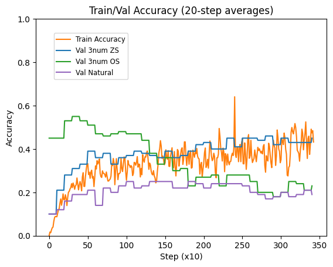

# Teaching a 1.5B Model Arithmetic with RL: What Transfers, What Doesn't, and When to Stop

## Introduction

We used Group Relative Policy Optimization (GRPO) to train Qwen2.5-1.5B-Instruct on a simple arithmetic task: given three numbers and a target, find an expression using +, -, * that equals the target using all three numbers exactly once. The task is easy to verify, hard enough to require learning, and simple enough to run many experiments quickly on a single GPU.

Our core question was not about the task itself, but about how **prompt format** interacts with RL training. We evaluated three prompt formats: **one-shot** (with a worked chain-of-thought example), **zero-shot** (with structured `<think>` and `<answer>` tags but no example), and **natural language** (plain question, no tags at all). We wanted to know: does training on one format transfer to others? Does curriculum learning help? How long should you train?

The answers were surprising. One-shot training is fast but brittle -- the skill doesn't transfer. Zero-shot training is slower but produces genuinely general arithmetic ability. Curriculum learning doesn't help at this scale. And perhaps most importantly, training reward is a poor proxy for actual capability: the model keeps improving on its training distribution long after it has started getting worse at everything else.

## Setup

**Task.** The countdown puzzle: given numbers drawn from [1, 10] and a target in [1, 100], produce an arithmetic expression using all numbers exactly once with +, -, *. Targets are generated by evaluating random left-associative expressions, ensuring solvability.

**Model and algorithm.** We start from Qwen2.5-1.5B-Instruct and train with GRPO: sample 16 completions per prompt at temperature 1.2, compute per-group advantages, and update with a PPO-clipped objective plus a KL penalty against the frozen base model. All models use 8-bit AdamW, bfloat16 precision, and gradient checkpointing.

| Parameter | Value |
|---|---|
| Learning rate | 2e-6 |
| Batch size | 4 prompts |
| Generations per prompt | 16 |
| Max new tokens | 160 |
| KL penalty (beta) | 0.01 |
| PPO clip (epsilon) | 0.2 |
| Gradient clipping | 0.5 |

**Prompt formats.** We test three formats at inference time, regardless of training format:

- **One-shot**: includes a worked example with chain-of-thought reasoning in `<think>...</think>` and the answer in `<answer>...</answer>` tags.
- **Zero-shot**: same tag structure but no example -- the model must figure out the format and solve the problem from scratch.
- **Natural language**: plain question with no tags at all. The answer is extracted by finding the last valid math expression in the output.

**Reward structure.** +0.1 for producing `<think>` tags, +0.1 for `<answer>` tags, +1.0 for a correct expression (overwrites format reward). This means the model gets partial credit for learning the output format even before it can solve problems.

**Evaluation.** All evaluations use greedy decoding on 100-200 fixed problems (seed=142) to ensure comparability across checkpoints. Train and validation sets are split by parity: training problems have at least one odd number, validation problems use only even numbers.

## One-Shot Training: Fast but Fragile

Training with a one-shot chain-of-thought example is remarkably effective. After 1200 steps (R1), the model's accuracy on one-shot prompts jumps from 24% to 69% -- a 45 percentage point gain. The model also picks up some transfer to harder 4-number problems it was never trained on (5% to 21%).

| Model | Prompt | Nums | Accuracy |
|---|---|---|---|
| Base | one-shot | 3 | 24.0% |
| Base | zero-shot | 3 | 2.0% |
| R1 (one-shot trained) | one-shot | 3 | 69.0% |
| R1 (one-shot trained) | zero-shot | 3 | 3.0% |
| R1 (one-shot trained) | one-shot | 4 | 21.0% |

But the skill is almost entirely format-coupled. When we remove the one-shot example and prompt R1 zero-shot, accuracy drops to 3% -- barely above the untrained base model. The model learned to solve countdown problems *conditional on seeing the example*, not unconditionally. It learned format mimicry, not arithmetic.

This makes sense in retrospect. For 3-number problems with only +, -, *, there are few enough combinations that the model can jump straight to the answer. The `<think>` block in R1's zero-shot output typically just repeats the expression from `<answer>` -- there is no genuine chain-of-thought reasoning. The one-shot example was load-bearing scaffolding, not a teaching tool.

## Zero-Shot Training: Slower but More General

Zero-shot training tells a different story. Without an example to lean on, the model is forced to internalize the arithmetic skill itself. After just 200 steps of zero-shot training (Base+ZS200), the model reaches 35% on zero-shot prompts -- and crucially, this skill transfers broadly.

| Model | Training | Prompt | Accuracy |
|---|---|---|---|
| Base | -- | one-shot | 24.0% |
| Base | -- | zero-shot | 2.0% |
| Base | -- | natural | 6.0% |
| Base+ZS200 | zero-shot, 200 steps | one-shot | 56.0% |
| Base+ZS200 | zero-shot, 200 steps | zero-shot | 35.0% |
| Base+ZS200 | zero-shot, 200 steps | natural | 21.0% |
| R1+ZS200 | one-shot then zero-shot | one-shot | 70.0% |
| R1+ZS200 | one-shot then zero-shot | zero-shot | 35.0% |

The transfer is strikingly asymmetric. Zero-shot training boosted one-shot accuracy from 24% to 56% (+32pp) despite never training on one-shot prompts. But the reverse doesn't work: one-shot training gave zero benefit to subsequent zero-shot training (both Base+ZS200 and R1+ZS200 reach identical 35% zero-shot accuracy). Zero-shot RL forces the model to build deeper representations that one-shot RL, with its scaffolding, never needs to develop.

Natural language transfer confirms this. Base+ZS200 reaches 21% on completely unstructured prompts with no `<think>` or `<answer>` tags -- up from 6% for the base model. The model learned real arithmetic, not just tag formatting.

Interestingly, prior one-shot training may actually hurt generalization to harder problems. On 4-number zero-shot, Base+ZS200 reaches 11% while R1+ZS200 only reaches 6%. R1's tightly format-coupled representations may interfere with the more general learning that zero-shot training provides.

## Curriculum Learning: No Free Lunch at 1.5B

A natural hypothesis is that curriculum learning -- starting with one-shot examples and gradually removing them -- might combine the benefits of both approaches. We tested "half-shot" training: linear decay from 100% one-shot at step 0 to 0% at step 1200, with a per-batch coin flip.

| Model | Training | Prompt | Accuracy |
|---|---|---|---|
| p2_zeroshot | zero-shot, 1200 steps | one-shot | 38.0% |
| p2_zeroshot | zero-shot, 1200 steps | zero-shot | 37.5% |
| p2_zeroshot | zero-shot, 1200 steps | natural | 16.5% |
| p2_halfshot | half-shot, 1200 steps | one-shot | 60.5% |
| p2_halfshot | half-shot, 1200 steps | zero-shot | 34.0% |
| p2_halfshot | half-shot, 1200 steps | natural | 16.5% |

The result is clear: at 1.5B scale, one-shot and zero-shot are largely **independent skills**. The model learns separate prompt-specific behaviors, and interleaving doesn't force shared representations. Half-shot training is the most balanced -- it's the only model that performs reasonably across all three formats -- but it doesn't meaningfully exceed what each format achieves independently given its share of the training budget.

The natural language results are identical (16.5% for both), suggesting that neither one-shot nor zero-shot exposure helps or hurts transfer to unstructured prompts beyond a certain point.

## The Overfitting Trap: When More Training Hurts

The most practically important finding emerged when we compared models at different training durations. Across both zero-shot and half-shot training, shorter runs consistently beat longer ones on cross-format generalization.

| Model | Steps | One-shot | Zero-shot | Natural |
|---|---|---|---|---|
| p2_zeroshot_200 | 200 | 51.5% | 29.0% | 22.0% |
| p2_zeroshot | 1200 | 38.0% | 37.5% | 16.5% |
| p2_halfshot_400 | 400 | 54.0% | 32.0% | 24.5% |
| p2_halfshot | 1200 | 60.5% | 34.0% | 16.5% |

After just 200 steps of zero-shot training, the model outperforms the 1200-step model on one-shot (51.5% vs 38%) and natural language (22% vs 16.5%). The 1200-step model wins only on its training distribution (zero-shot: 37.5% vs 29%). The same pattern holds for half-shot training: 400 steps beats 1200 on natural (24.5% vs 16.5%), while 1200 is only marginally better on one-shot and zero-shot.

To understand the dynamics in detail, we ran an extended zero-shot training run with periodic evaluation every 100 steps on a fixed problem set.

The overfitting is progressive and format-dependent. The further a prompt format is from the training distribution, the earlier it peaks and the sooner it starts declining. One-shot accuracy peaks first, around step 200-300 at roughly 50%, then steadily erodes. Natural language plateaus before step 1000, then begins to decay. Only zero-shot accuracy -- the training distribution -- keeps climbing past step 2000.

The training reward, meanwhile, continues to rise throughout. This is the core trap: the signal you're optimizing looks healthy, but the model's actual capabilities are narrowing with every step.

## Conclusions

**One-shot learning is highly efficient but non-transferable.** Providing an in-context example during RL training produces dramatic accuracy gains (24% to 69% on 3-number countdown), but the resulting skill is tightly coupled to the one-shot prompt format. Remove the example at inference time and performance collapses to near-baseline levels. The model learns conditional problem-solving, not unconditional arithmetic.

**Zero-shot training builds genuinely general skill -- if stopped early.** Without a worked example to lean on, the model is forced to internalize arithmetic more deeply. Early zero-shot training (around 200 steps) improves performance across all prompt formats: zero-shot, one-shot, and natural language alike. But this generality is fragile. Continued training progressively narrows the model's competence back toward the exact training format, eroding the cross-format transfer that makes early training so valuable.

**Curriculum learning does not produce meaningful skill transfer at 1.5B scale.** Gradually shifting from one-shot to zero-shot prompts during training does not create shared representations between the two modes. The model treats them as independent skills and learns each in proportion to its exposure. Interleaving is a reasonable default for balanced performance, but it is not a shortcut to deeper generalization.

**Overfitting to prompt format is progressive and format-distance-dependent.** The further an evaluation format is from the training distribution, the earlier it peaks and the sooner it degrades. One-shot inference peaks first, then natural language, while the training format keeps improving indefinitely. This creates a particularly insidious failure mode: all the signals visible during training (reward, training accuracy) suggest continued improvement, while the model's actual breadth of capability is shrinking.

**Training reward is not a reliable stopping criterion.** In practice, training should be guided by a custom evaluation suite covering the tasks and formats we actually care about, not by the reward signal. The reward will keep going up long after the model has started getting worse at everything except its training distribution.
